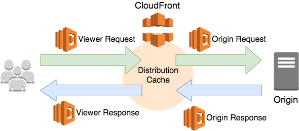

# lambda-cloudfront-proxy (WIP)

Lambda@Edge allows running Lambda functions at Edge Locations of the CloudFront CDN. It means you may add “intelligence” in the CDN, without having to forward the request to a backend and losing benefits of content caching and geographical proximity with the client.



Lambda@Edge opens a number of very interesting use cases. Unfortunately, documentation is still poor, examples not so useful and tooling support non-existent or sparse, this is why we developed this module, it's written in Typescript and uses Yarn and Rollup for builds.

## Why Lambda@Edge

Please read this documentation from the official AWS Guide here [AWS Lambda@Edge](https://docs.aws.amazon.com/AmazonCloudFront/latest/DeveloperGuide/lambda-at-the-edge.html) and more information about the specific behavior and intended use of this helper under [Code Samples](https://docs.aws.amazon.com/AmazonCloudFront/latest/DeveloperGuide/lambda-examples.html) which describes from use cases.

## Benefits

A typical deployment would see this Lambda@Edge Proxy being deployed for Canary releases, where it would have Business Rules that determine, e.g. which version of assets to server in a Static S3 Bucket, together with a version of the API in the API Gateway deployment.

This solution allows leveraging CDN caching, keeping both versions of content in the cache, and removes the need for the application to know about or support the behavior of Canary Deployments.

This could either be directly set by a Cookie, or a query parameter, such as <https://service.telia.io?release=1.0.0-h32434a-201905151232-rickard-test>, which would serve the contents of the folder `/1.0.0-h32434a-201905151232-rickard-test`in the S3 Bucket, together with a compatible on `/api/` using either Headers or URL-rewrite.

## Installation

Use the package manager [yarn](https://yarnpkg.com/en/) to install all the dependencies of `lambda-cloudfront-proxy`.

```shell
make install
```

## Build and Deploy

```shell
 make build
```

This project produces the following Lambda@Edge functions in JavaScript used in the life-cycle of a request.

* After CloudFront receives a request from a viewer (viewer request)
* Before CloudFront forwards the request to the origin (origin request)
* After CloudFront receives the response from the origin (origin response)
* Before CloudFront forwards the response to the viewer (viewer response)

The output will output the three lambdas in the `./dist` directory.

```shell
./dist/
├── origin-request.js
├── origin-response.js
└── viewer-request.js
```

Use any tooling you feel necessary to deploy this into your environment.

## Usage

The below example details how to do a 50/50 A/B test against `REPLACEMENT_ORIGIN_DOMAIN_NAME` which is a constant, the assignment is locked down with a Cookie, in this case `COOKIE_PATH` in order to optimize.

```typescript
import { CloudFrontRequest } from 'aws-lambda';

import { SourceDelegate } from '../triggers/delegates/source-delegate';
import {
  COOKIE_PATH,
  REPLACEMENT_ORIGIN_DOMAIN_NAME,
  SOURCE_COOKIE_NAME,
  SOURCE_MAIN,
  SOURCE_REPLACEMENT
} from './constants';

export class ExampleSourceDelegate implements SourceDelegate {
  get cookieName(): string {
    return SOURCE_COOKIE_NAME;
  }

  get cookiePath(): string {
    return COOKIE_PATH;
  }

  public shouldCache(request: CloudFrontRequest): boolean {
    return true;
  }

  public decideSource(cloudFrontRequest: CloudFrontRequest): string {
    const m = 0.5;
    return Math.random() < m ? SOURCE_REPLACEMENT : SOURCE_MAIN;
  }

  public shouldSubstituteOrigin(cloudFrontRequest: CloudFrontRequest, source: string): boolean {
    return source === SOURCE_REPLACEMENT;
  }

  public substituteOrigin(cloudFrontRequest: CloudFrontRequest, source: string) {
    if (cloudFrontRequest.origin == null || cloudFrontRequest.origin.custom == null) {
      return;
    }
    if (source === SOURCE_REPLACEMENT) {
      cloudFrontRequest.origin.custom.domainName = REPLACEMENT_ORIGIN_DOMAIN_NAME;
      cloudFrontRequest.headers.host = [{ key: 'host', value: REPLACEMENT_ORIGIN_DOMAIN_NAME }];
    }
  }
}

```

## Requirements and Limitations

This section displays the requirements and limitations of the Lambda@Edge Proxy.

### No environment for Lambda@Edge

The configuration must be hardwired in the code or read from an S3 Bucket, as no environment variable is supported.

### Execution logs roam across CloudWatch Regions

Execution logs from Lambda@Edge functions go to CloudWatch, as for normal Lambda functions, but where the Region logs end up in is not obvious. Logs go to the Region of the Edge Location the function is executed in.

This typically is the Edge Location the client request is directed to. It is usually the Location closest to the client, but not necessarily as the lambda is distributed evenly across regions.

Log Groups get qualified with the name of Region the function is stored in (not where it is executed).

So the Log Group is always `/aws/lambda/us-east-1.<function-name>` …except when function executes in us-east-1, as it happens when you run it from AWS Console for debugging. In this case the Log Group is instead `/aws/lambda/<function-name>`

### Change Host header when changing Origin

If you change the Origin, don’t forget to change the `Host` header accordingly, to avoid “The request signature we calculated does not match the signature you provided” errors.

### Switching Origin in Origin Request only

The request Origin may be changed only in Origin Request, not in Viewer Request. This way the response get always cached.

Do not forget to set up the Default Behavior to forward the element you are using for deciding the Origin (the cookie or request body), or the Origin Request function would not receive it.

### Forwarded Cookies are part of the cache key

A forwarded cookie becomes part of the cache key, along with the object URI, regardless the Origin is ignoring it (e.g. S3).

The Behavior must Forward the X-Source cookie, as a whitelist. This cookie becomes part of the cache key.

### Redirect Behavior for S3 Origin

You need to modifiy the behavior of the S3 bucket origin, in order to re-direct 404 errors from the S3 Bucket Origin not finding the requsted resource, otherwise you will not be able to use the SPA's routing, since the behavior by default looks for the resource.

The easiest way to do othat is to re-direct everything to `index.html`, you will still be able to respond with HTTP Error codes from within your routing library.

## Todo / WIP

* Terraform
* NPM Module distribution
* More examples

## Contributing

Pull requests are welcome. For major changes, please open an issue first to discuss what you would like to change.

Please make sure to update tests as appropriate.

## License

[MIT](https://choosealicense.com/licenses/mit/)
